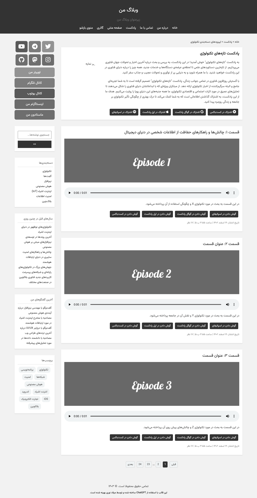

<!-- README.md file written by ChatGPT. -->
## Simple RTL Blog Template

This is a simple, right-to-left (RTL) blog template designed for easy customization and deployment. It was created by [ChatGPT](https://openai.com/) and modified by [Milad Nouri](https://github.com/miladnouri).

---

### Usage

This template offers two versions:

- **HTML Version**: The HTML version is located in the `html` folder. It's suitable for users who prefer working with standard HTML.

- **Pug Version**: The Pug (formerly Jade) version is available in the `pug` folder. Pug is a concise and expressive templating language for HTML.
Use this version if you prefer Pug for templating.

    `pug -w ./pug -o ./html -P `

---

### 🚀 Features

- Minimal design for easy customization
- Fully responsive layout
- Built-in support for syntax highlighting
- Simple and easy-to-use navigation menu

---

### 📂 Pages Included

| Page | Description |
|------|------------|
| **Blog Page** | Display your latest blog posts, allowing readers to engage with your content. |
| **Podcast Page** | Share your podcast episodes and provide users with an easy way to listen to them. |
| **Contact Page** | Allow visitors to get in touch with you through a convenient contact form. |
| **FAQ Page** | Answer frequently asked questions with expandable FAQ items to improve user experience. |
| **About Page** | Share information about yourself or your blog and invite donations to support your project. |
| **Timeline Page** | Showcase the author's journey and milestones in a visually appealing timeline format. |
| **Donation Page** | Allow users to support the project financially through various payment options. |
| **Static Page** | Create additional static pages to showcase various content, such as a portfolio or testimonials. |
| **Gallery Page** | Display a collection of images to captivate your audience visually. |

---

### Used By

- https://milad.nu/
- [Add your website to the list!]

### How To Contribute

Contributions are welcome and encouraged! If you have any suggestions, bug fixes, or improvements, please follow these steps:

1. Fork this repository to your own GitHub account.
2. Clone the forked repository to your local machine.
3. Create a new branch for your changes.
4. Make your changes, commit them, and push to your forked repository.
5. Create a pull request from your forked repository's branch to the original repository's `main` branch.

Please ensure that your contributions align with the purpose of this template and follow best practices for coding and documentation.

---

### Credits
- [ChatGPT](https://openai.com/): Original template creator
- [Milad Nouri](https://github.com/miladnouri): Modifications and updates to the template

---

### 💰 Support My Work & Content  

If you find my projects and content valuable and would like to support my efforts, consider making a donation.  

👉 **[Donate Now](https://milad.nu/donate)** ❤️

---

### 📸 Screenshots

  
  
  
  
  
  
  

---

### 📢 Stay Connected  

Follow my **Telegram channel** for updates, new projects, and my contents!  

👉 **[Join @miladnourichannel](https://t.me/miladnourichannel)**  